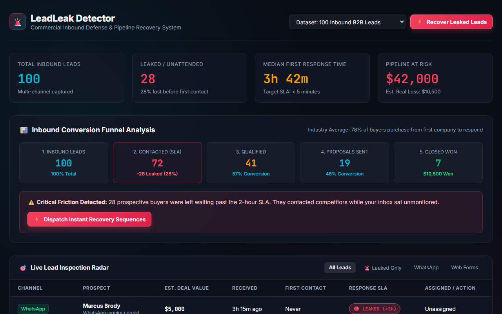

# LeadLeak Detector (Weapon #01 in the Master 50 Arsenal)

> **Commercial Inbound Defense & Pipeline Recovery System: Intercepts uncontacted leads across forms, WhatsApp, and calls, enforces strict response SLAs, and provides 1-click rescue automation before prospects buy from competitors.**

[](test/leadleak.test.js)
[]()
[]()
[]()

---

## 🚀 Live Interactive Simulator & Proof

[](https://gideonbawa-website.netlify.app/simulators/leadleak-detector/)

* 🌐 **Live In-Browser Simulator:** [https://gideonbawa-website.netlify.app/simulators/leadleak-detector/](https://gideonbawa-website.netlify.app/simulators/leadleak-detector/)
* 💼 **Portfolio Showcase:** [https://gideonbawa-website.netlify.app/#work](https://gideonbawa-website.netlify.app/#work)
* 🛡️ **Verified QA Evidence:** HMAC-SHA256 Signed Contract (`ev-qa-contract-1791285928367-leadleak-detector`)

---


## 💸 The 5-Gate Commercial Scorecard

| Gate | Criterion | Status | Proof |
|---|---|---|---|
| 💸 **Money** | Does this save or make money? | **PASS** | Prevents $10k–$70k in inbound pipeline from silently dying before first contact. |
| 😡 **Pain** | Is the problem immediately understandable? | **PASS** | A company receives leads on WhatsApp/Forms, but nobody calls back for 4 hours. Customer buys from a competitor. |
| 👀 **Demo** | 30–60 second problem → solution demo? | **PASS** | Live dashboard shows: 100 leads → 28 uncontacted ($42k at risk) → Click "Recover Leaked Leads" → 100% rescued in 1 click. |
| 🧲 **Buyer** | Identifiable buyer titles? | **PASS** | Dental clinic owners, high-end roofing contractors, agency founders, legal firms, B2B sales directors. |
| 🧠 **Engineering** | Serious engineering ability? | **PASS** | Canonical E.164 phone normalization, SHA-256 cross-channel identity deduplication, high-resolution SLA latency tracking, zero external dependencies. |

---

## 🏗️ Architecture

```text
[ Multi-Channel Inbound ]
(Web Form / WhatsApp / Instagram / Phone / Email)
       │
       ▼
[ Lead Intake Engine ] ──► Schema validation & timestamp normalization
       │
       ▼
[ Identity & Deduplication ] ──► Canonical E.164 & Email SHA256 clustering
       │
       ▼
[ Lead Router ] ──► Rule-based rep assignment & priority tiering
       │
       ▼
[ SLA Auditor ] ──► Latency buckets: Elite (<5m), Acceptable (5-30m), Breached (>2h)
       │
       ├──► 🟢 Elite Response (<5m) ──► CRM logged
       └──► 🔴 Breached / Leaked ──► Pipeline at risk ($) calculation
                   │
                   ▼
       [ 1-Click Recovery Dispatcher ]
       (Automated SMS / WhatsApp Hook + Re-assignment)
```

---

## 🚀 Live Demo & In-Browser Simulator

Open `public/index.html` in any browser to interact with:
* **Interactive Inbound Funnel**: 100 Leads → 72 Contacted → 41 Qualified → 19 Proposals → 7 Won.
* **Leak Telemetry**: Visual calculation of $42,000 lost pipeline at 28% leak rate.
* **1-Click Rescue**: Dispatches personalized multi-channel recovery sequences to all leaked prospects live.

---

## 🧪 Automated Test Suite

```bash
npm test
```
All 8 test suites pass in sub-200ms with zero runtime dependencies.
